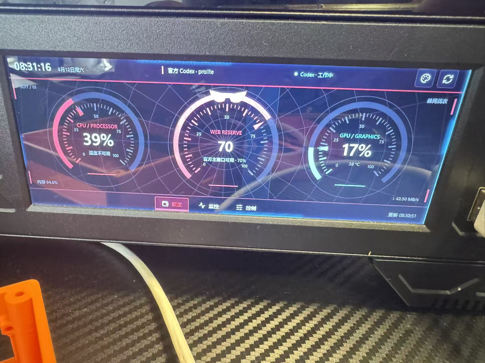
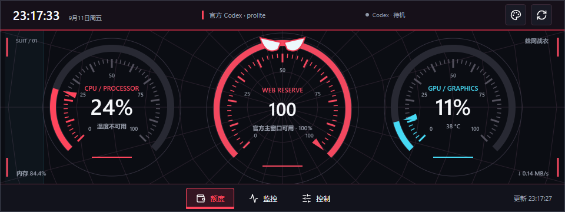
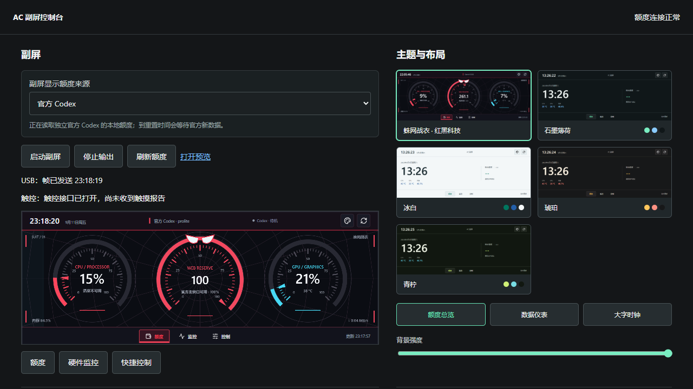

<div align="center">

# AC 额度副屏工具

**为带内置副屏的 Windows 电脑打造的 Codex 额度、任务状态与硬件监控面板**


</div>

## 实机效果

本项目目前实际运行在一台**带内置副屏的瓦尔基里机箱**上。副屏通过 USB 输出 960 × 360 横向画面，可以直接显示 Codex 额度、任务状态和电脑硬件信息。



> 实机照片中的界面为程序实际输出效果，不是设计稿或合成图。不同机箱、副屏控制板和旋转方向可能需要调整显示参数。

## 项目简介

AC 额度副屏工具在 Windows 本机运行，不会上传聊天内容。副屏可以在两种额度来源之间切换：

- **官方 Codex**：读取独立官方 Codex 配置目录中的本地 session 事件，自动识别使用百分比、剩余百分比和额度重置时间。
- **Codex++ 中转站**：通过已保存的中转站 `/v1/usage` 接口读取额度，保留原有配置方式。

切换“显示来源”只影响副屏显示，不会启动、关闭或修改任意一套 Codex 配置。官方 Codex 与 Codex++ 可以保持独立运行。

## 四周跑马状态灯

副屏四周带有一圈与 Codex 任务状态联动的跑马灯。它读取本机 session 中的任务事件，只判断状态，不读取或展示聊天正文。

| 状态 | 灯光表现 | 含义 |
| --- | --- | --- |
| 工作中 | 蓝色光条沿上、右、下、左四边循环移动 | Codex 正在执行任务或调用工具 |
| 等待确认 | 黄色边框呼吸闪烁 | 正在等待用户确认、授权或补充输入 |
| 已完成 | 绿色边框提示 | 最近一个任务已经完成 |
| 任务出错 | 红色边框提示 | 任务执行失败或出现错误 |
| 待机 / 未连接 | 灰色弱化，隐藏移动光条 | 当前没有活跃任务，或本地服务未连接 |

状态灯可以在“主题与布局”中关闭；系统启用“减少动态效果”时，跑马动画也会自动停用。

## 界面预览

### 官方 Codex 额度



### 控制台与显示来源切换



## 功能特性

- 官方 Codex / Codex++ 额度来源切换
- 官方额度自动识别与重置时间显示
- 额度到期后自动等待官方新快照，避免显示过期数据
- 四边 Codex 任务状态跑马灯
- CPU、GPU、内存、温度、功耗和网络速率监控
- 额度、硬件监控、快捷控制三种页面
- 多主题、多布局、背景媒体和自定义 CSS
- Windows 桌面 WebView 控制台与 USB 副屏输出
- 中转站 API Key 使用 Windows DPAPI 加密保存
- 本地会话状态只读取事件类型，不导出聊天内容

## 硬件与显示说明

当前版本针对项目作者使用的瓦尔基里机箱内置副屏进行了实际测试：

- 推荐画面尺寸：`960 × 360`
- 默认旋转方向：`270°`
- 输出方式：USB 副屏控制板
- 触控：支持兼容 HID 的触控接口；如果 Windows 未开放读取权限，仍可在电脑端控制
- 占用提示：使用副屏前应退出可能独占同一设备的原厂副屏软件

本项目包含针对当前设备的 USB 通信实现，并不保证所有瓦尔基里型号或其他品牌副屏可直接使用。欢迎提交 Issue 补充设备型号、VID/PID 和测试结果。

## 快速开始

### 运行源码

```powershell
python -m venv .venv
.\.venv\Scripts\pip install -r requirements.txt
.\.venv\Scripts\python app.py
```

然后打开桌面程序或访问本机控制台。首次使用时，在“中转站”区域添加中转站地址和 API Key；如果选择官方 Codex，则确保独立官方 Codex 已经产生过本地 session 事件。

### 打包 Windows 程序

```powershell
.\.venv\Scripts\pyinstaller.exe --noconfirm ACQuotaScreen.spec
```

生成文件位于 `dist/ACQuotaScreen/ACQuotaScreen.exe`。

## 配置说明

运行配置位于 `%LOCALAPPDATA%\\ACQuotaScreen\\config.json`，不会提交到 GitHub。中转站密钥不会写入项目源码；仓库只包含配置结构和示例逻辑。

官方 Codex 默认读取：

```text
%USERPROFILE%\\.codex-official\\sessions
```

Codex++ 默认使用原有安装和配置，不会覆盖官方 Codex 的登录数据。

## 项目结构

| 文件 | 作用 |
| --- | --- |
| `app.py` | 本地 Flask 服务、轮询、API 和副屏输出 |
| `official_quota.py` | 官方 Codex 本地额度事件解析 |
| `service.py` | 中转站额度接口与响应格式化 |
| `codex_status.py` | Codex 本地任务状态监听 |
| `config_store.py` | 配置保存与 DPAPI 加密 |
| `desktop.py` | Windows WebView 控制台宿主 |
| `static/status-light.*` | 四周跑马状态灯与状态配色 |
| `templates/` | 控制台和副屏页面 |
| `static/` | 页面脚本、主题和图标 |

## 测试

```powershell
.\.venv\Scripts\python.exe -m unittest test_official_quota.py test_codex_status.py test_app.py
```

## 隐私与安全

- 项目不会上传聊天正文。
- API Key 仅保存在本机，并通过 Windows DPAPI 加密。
- `config.json`、日志、缓存和构建产物均已加入 `.gitignore`。
- 公开仓库不包含账号、Cookie、API Key 或本机运行配置。

## 开源协议

本项目使用 [MIT License](LICENSE) 开源。你可以自由使用、复制、修改、合并和分发代码，但需要保留原始版权与许可声明。项目按“现状”提供，不附带任何形式的担保。

## 商标说明

Codex、Codex++、瓦尔基里及其他名称和标识归各自权利人所有。本项目是独立的个人开源工具，与相关品牌不存在官方隶属、授权或背书关系。
